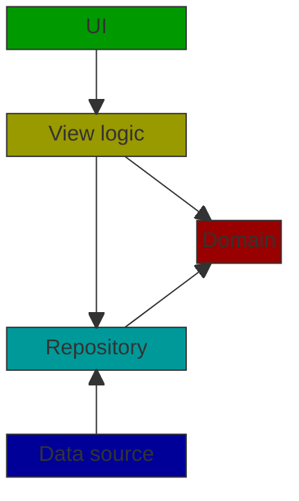

# The Lord of the Rings Character Wiki

## Kotlin Multiplatform List-Detail sample application

### Supported platforms

- Android
- JVM Desktop
- iOS

### Planned platforms to support

- Web (using WASM)

### Prerequisites

The application uses [The One API](https://the-one-api.dev/) as its backend datasource. To use the application you need
to first register on the API's webpage, and obtain an API key. After the API key is received, placed it into the
[local.properties](local.properties) file with *THE_ONE_API_KEY* key.

### Architecture

The application is built using a Clean Architecture implementation.

Please note that for a list-detail application a simpler approach can be sufficient.

### UI layer

The UI layer is built with [Compose Multiplatform](https://www.jetbrains.com/lp/compose-multiplatform/). The UI follows 
[Material 3](https://m3.material.io/) design.

### View Logic Layer

The view logic layer is implemented with [Decompose](https://arkivanov.github.io/Decompose/) and 
[MVIKotlin](https://arkivanov.github.io/MVIKotlin/).

- **Decompose** is used to implement navigation and to publish view logic actions to the UI. The Decompose components
also use InstanceKeeper of the [Essenty](https://github.com/arkivanov/Essenty) library to ensure that the view logic's
state is preserved after platform specific configuration changes.
- **MVIKotlin** is used to implement the core of the view logic based on Flux architecture.

### Domain layer

The domain module contains the domain models of the application. They are implemented with Kotlin's
[value classes](https://kotlinlang.org/docs/inline-classes.html).

### Repository layer

The repository layer contains the repository classes' implementations, and the datasource interfaces.

### Datasource layer

The datasource layer contains the implementation of the datasources.
- To implement HTTP communication, [Ktor client](https://ktor.io/docs/client-create-new-application.html) is used.
- To store persisted structured data on Android Room, on the other platforms [SQLDelight](https://cashapp.github.io/sqldelight) is 
used. (Note that SQLDelight could be also used on Android.)

### Dependency Injection

DI is implemented using [Koin](https://insert-koin.io/).

### Unit testing

Sample test cases is implemented in the commonTest source set using the official 
[Kotlin Test](https://kotlinlang.org/api/latest/kotlin.test/) library.