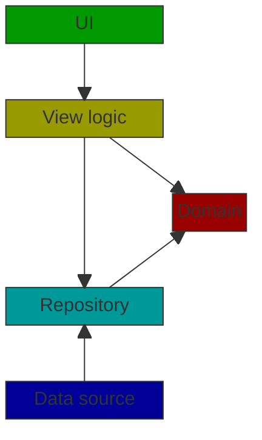

# Design

## Architecture

The application is built using a Clean Architecture implementation.

Please note that for a list-detail application a simpler approach can be sufficient.

### UI layer

The UI layer is built with [Compose Multiplatform][compose-multiplatform].

### View Logic Layer

The view logic layer is implemented with [Decompose][decompose] and [MVIKotlin][mvi-kotlin].

- **Decompose** is used to implement navigation and to publish view logic actions to the UI. The Decompose components
  also use InstanceKeeper of the [Essenty][essenty] library to ensure that the view logic's
  state is preserved after platform specific configuration changes.
- **MVIKotlin** is used to implement the core of the view logic based on Flux architecture.

### Domain layer

The domain module contains the domain models of the application. They are implemented with Kotlin's
[value classes][kotlin-value-classes].

### Repository layer

The repository layer contains the repository classes' implementations, and the data source interfaces.

### Data source layer

The data source layer contains the implementation of the data sources.
- To implement HTTP communication, [Ktor client][ktor-client] is used.
- To store persisted structured data on Android Room, on the other platforms [SQLDelight](https://cashapp.github.io/sqldelight) is
  used. (Note that SQLDelight could be also used on Android.)

### Dependency Injection

Components are created and injected using Dependency Injection (DI). DI is implemented using [Koin][koin].

### Reactive programming

TODO

## Network communication

TODO

## Persistent data storing

TODO

## Screen states

TODO

## Static behaviour

TODO

## Dynamic behaviour

TODO

## Testing

### Unit testing

Sample test cases is implemented in the commonTest source set using the official
[Kotlin Test][kotlin-test] library.

## Third party dependencies

TODO

[compose-multiplatform]: https://www.jetbrains.com/lp/compose-multiplatform/
[decompose]: https://arkivanov.github.io/Decompose/
[essenty]: https://github.com/arkivanov/Essenty
[koin]: https://insert-koin.io/
[kotlin-test]: https://kotlinlang.org/api/latest/kotlin.test/
[kotlin-value-classes]: https://kotlinlang.org/docs/inline-classes.html
[ktor-client]: https://ktor.io/docs/client-create-new-application.html
[mvi-kotlin]: https://arkivanov.github.io/MVIKotlin/